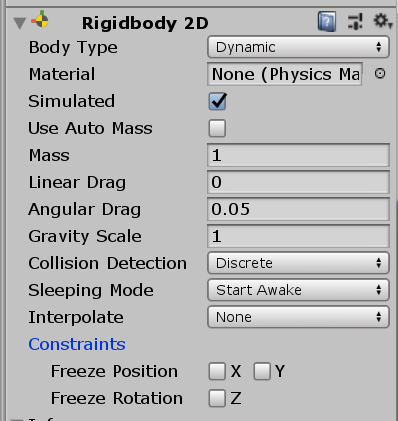

# 캐릭터 이동시키기

  ## c#스크립트 알아보기
  
  ### c#스크립트란? 
 c#스크립트란 c++의 강력함 + VB의 편리함 + JAVA의 독립적 플랫폼 장점들을 모두 모은 유니티에서 사용하는 언어입니다.    
  UNITY의 c#스크립트의 기본적인 구성을 알아보면,  
   ```c#
   using System.Collections;
   using System.Collections.Generic;
   using UnityEngine;
   
   public class name : MonoBehaviour
   {
      void start()
      {
      }
      void update()
      {
      }
   }
```
  위의 코드를 살펴보면, 첫줄의 `using` 은 다른 lib의 코드를 import하는 기능으로 ~, `public class` 는 자바의 객체 역할을, 마지막으로 `void Start()` 는 자바의 메소드를 의미합니다.
  
  스크립트를 실행하면 Start(실행 시)와 Update(실행 중)메소드 안에 작성한 스크립트 코드가 실행됩니다.
  


  
  이제 본격적으로 캐릭터를 직접 코딩해 봅시다.  
  
  ***
   ### Player c#프로그래밍
  
   앞에서 배운 c#스크립트를 이용하여 캐릭터의 움직임을 관리하는 스크립트를 작성해 보겠습니다.
   ```c#
    public class PlayerMovement : MonoBehaviour {
    
       public float movePower = 1f;
       public float jumpPower = 1f;
       
       Rigidbody2D rigid;
       
       Vector3 movement;
       bool isJumping =false;
       
       
       void Start()
       {
          rigid = gameObject.GetComponent<Rigidbody2D> ();
       }
```
   위의 코드를 한번 분석해봅시다.
   
   
   <br>이후 스크립트 `Update` 를 설정해줍니다.
   ```c#
   void Update()
   {
      if (Input.GetButtonDown ("Jump")) {
         isJumping = true;
      }
   }
   
   void FixedUpdate()
   {
      Move();
      Jump();
   }
   ```
   
   먼저 `Update` 와 `FixedUpdate` 를 구분해 설명하겠습니다.<br>
   
   #### Update vs FixedUpdate
#### Update  
* 프레임당 1회 호출   
* 불규칙적으로 실행 (물리엔진 충돌검사 등이 제대로 안될 수 있음)  
* 주로 단순한 타이머, 키 입력을 받을 때 사용   

#### FixedUpdate   
* 고정적인 시간을 기준으로 반복   
* 프레임에 기반하지 않아 물리 계산에 유리   
* 주로 물리 효과가 적용된 오브젝트를 조정할 때 사용  
     
#### LateUpdate(참고)
* 위 Update 함수가 모두 호출 된 후, 마지막으로 호출      
* 주로 오브젝트를 따라가는 카메라에 설정 
     
     
     
추가로 설정해줄 부분을 살펴보면 다음과 같습니다.

 


# [다음강의](L3.md)
