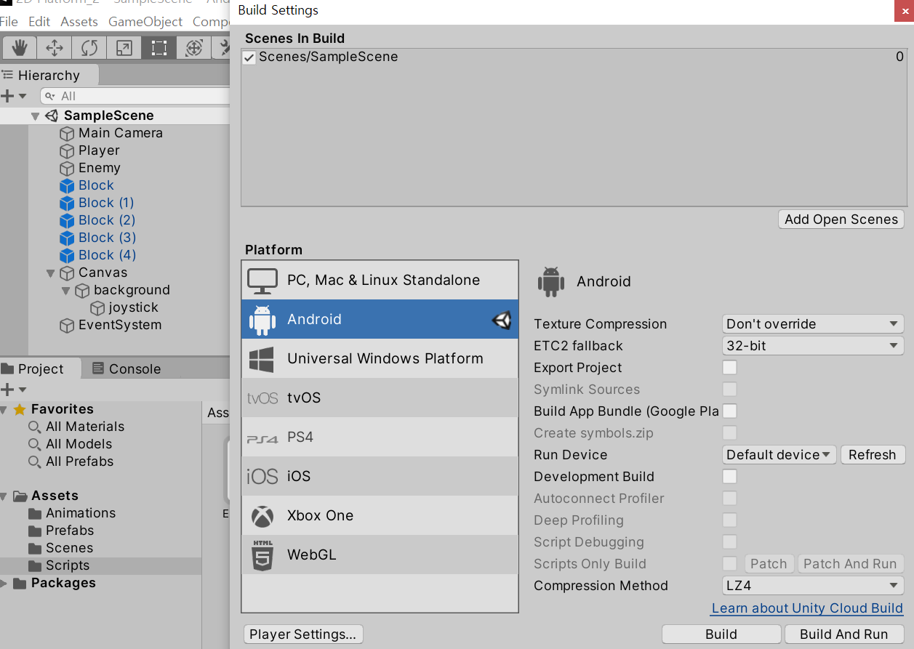
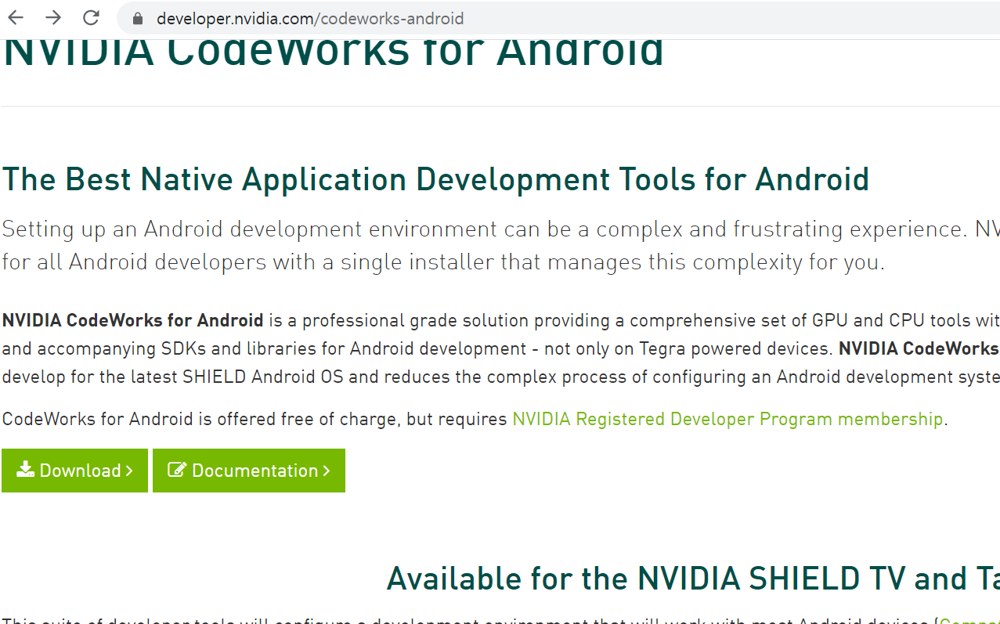
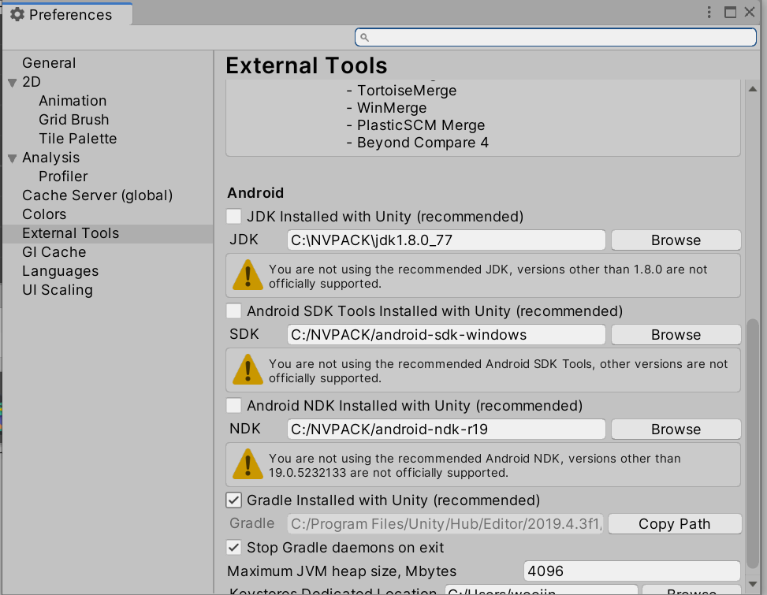
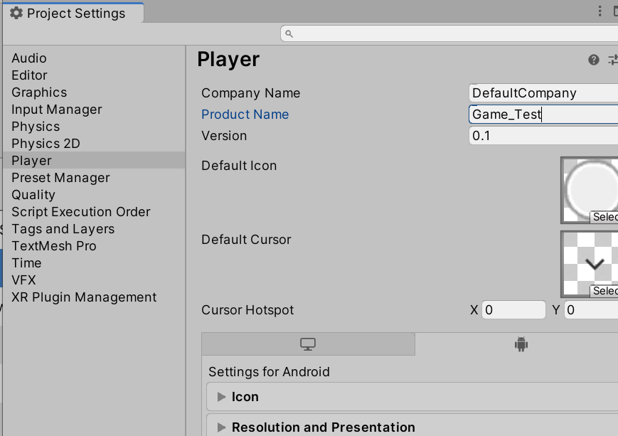
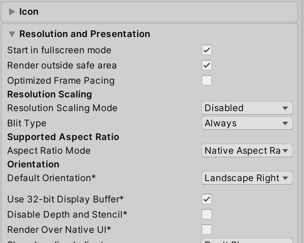

[목록으로 돌아가기](L1.md)
# 플랫폼 게임 만들기 3

## 수업내용

- 안드로이드 어플 개발하기
    - Canvas란
    - 조이스틱 기능 추가하기
    - 스크립트 수정 및 보완하기
- 활용방안 생각하기

# 안드로이드 어플 개발하기

 현재까지 개발한 게임을 안드로이드 입으로 플랫폼을 옮겨 제작해 보겠습니다. 안드로이드 앱으로 변환시 입력받는 키가 키보드에서 터치로 변경된다는 점을 고려해주어야 합니다. 

 UI 기능을 사용하기 전에 캔버스에 대해 알아보겠습니다.

## Canvas란

 유니티에서 모든 UI 객체의 렌더링을 관리하기 위한 컴포넌트 입니다. 즉, 유니티의 모든 UI 구성 요소들은 캔버스 밑에 위치해야합니다. 캔버스의 UI요소는 계층 구조이므로 순서에 주의하여 배치해주어야합니다. 즉, 위에 배치된 UI가 두번째 UI에 가려 보이지 않게됩니다.

### Render Mode

**스크린 공간 - 오버레이**

가장 기본이 되는 모드로 모든 UI 요소가 제일 위에 렌더링 되는 경우입니다.

**스크린 공간 - 카메라**

캔버스가 씬의 특정 카메라에서 주어진 거리만큼 앞쪽에 위치합니다. UI요소를 원근감있게 렌더링 할 수 있습니다.

**월드 공간**
캔버스가 다른 게임오브젝트처럼 동작합니다.


## 조이스틱 기능 추가하기

 휴대폰에서 터치를 입력받기 위해 조이스틱 기능을 추가해보겠습니다.

먼저 UI를 배치할 Canvas를 생성해줍니다.


이후 받아두었던  grey_circle 이미지 파일을 이용하여 조이스틱 모양을 만들어주겠습니다.


Canvas안에 UI > Image로 background 이름의 이미지를 만들어줍니다.  
같은방법으로 background자녀 오브젝트로 joystick 이름의 이미지를 만들어줍니다.  
각각의 Source Image에 앞서 받아둔 grey_circle을 적용해준 후 적당한 곳에 배치해줍니다.    


## 스크립트 수정 및 보완하기

이제 이 조이스틱을 컨트롤할 스크립트를 제작해보겠습니다. "Assets/ Scripts"에 **JoystickController.cs** 의 스크립트를 생성합니다.


### JoystickController 스크립트 코딩하기

```csharp
using System.Collections;
using System.Collections.Generic;
using Unity.Mathematics;
using UnityEngine;
using UnityEngine.EventSystems;

public class JoystickController : MonoBehaviour, IDragHandler, IPointerDownHandler, IPointerUpHandler

{
    public GameObject background;
    public GameObject joystick;

    private float background_radius;
    private Vector3 center;
    private Vector3 Axis;

    void Start()
    {
        center = this.transform.position;
        // JoystickBackground의 반지름입니다.
        background_radius = background.GetComponent<RectTransform>().rect.width / 2;
    }

    void Update()
    {
        //Debug.Log(background_radius);
    }

    public void OnDrag(PointerEventData eventData)
    {
        Vector3 fingerPos = Input.mousePosition;
        // 중심과의 거리를 이용하여 이동합니다.
        Axis = (fingerPos - center).normalized;

        float fDistance = Vector3.Distance(fingerPos, center);
        // 최대 이동가능한 범위를 정해둡니다.
        if (fDistance > background_radius) joystick.transform.position = center + Axis * background_radius;
        else joystick.transform.position = center + Axis * fDistance;
        
        PlayerMovement.horizontal = Axis.x;
    }

    public void OnPointerDown(PointerEventData eventData)
    {
        joystick.transform.position = Input.mousePosition;
        Vector3 fingerPos = Input.mousePosition;
        
        Axis = (fingerPos - center).normalized;

        PlayerMovement.horizontal = Axis.x;
    }

    public void OnPointerUp(PointerEventData eventData)
    {
        // 원래 위치로 되돌립니다.
        joystick.transform.position = center;
        Axis = Vector3.zero;
        PlayerMovement.horizontal = 0;
    }

}
```

 이후 PlayerMovement.cs의 move메소드의 horizontal 관련 코드를 지워야 충돌없이 정상 작동 가능합니다.

 아래의 코드를 찾아 삭제해줍니다.

```jsx
       // horizontal = Input.GetAxis("Horizontal");
```

 마지막으로 "Canvas / background" 와 "Canvas / joystick"을 JoystickController과 연결해줍니다.


## 안드로이드 빌드하기

### 빌드 스위칭
현재 유니티에서 빌드 설정값은 기본값인 윈도우로 되어 있습니다. 스마트폰에서 동작가능한 apk파일로 만들어 주기 위해, 우선 빌드부터 스위칭해주는 작업이 필요합니다.
유니티 화면에서 단축기 Ctrl+Shift+B를 눌러 Build Setting에 들어가 줍니다.
우선 Scenes in Build에서 Add Open Secenes를 통해 게임에 출력될 화면을 추가해 줍니다.



그런 다음, 왼쪽 Platform창에서 Android를 클릭한 뒤, Switch Platform을 해줍니다.
시간이 많이 소요될 수 있습니다.


### NVIDIA CodeWork 다운
유니티에서 안드로이드 빌드를 하기 위해선 JDK(자바 개발 키트), Android SDK(소프트웨어 개발 키트), Android NDK(Native 개발 키트)가 필요합니다.
그래서 이 3개의 소프트웨어를 다운받기 위해 NVIDIA에서 제작한 CodeWork를 다운받아야 합니다.
우선 https://developer.nvidia.com/codeworks-android에 들어가줍니다.


Download를 눌러 NVIDA CodeWork for Android를 다운 받아줍니다. 이때 NVIDA에 회원가입을 해야 다운을 받을 수 있습니다.



Automatically resolve dependency conflicts를 체크한 뒤, 다운로드를 시작해 줍니다.
완료 후에는, 컴퓨터를 재부팅시켜줍니다.


### JDK, SDK, NDK Path 설정하기
설치가 완료됬으면, 유니티의 Edit-Preference-External Tools에서 JDK, SDK, NDK 각각의 Path를 설정해 줍니다.
CodeWorks 설치 위치가 기본값 기준으로 C:\NVPACK에 있습니다.

그림과 같이 JDK, SDK, NDK의 Path를 해당 파일이 존재하는 위치로 지정해둡니다.



[주의!]이때 만약 NDK의 경우 버전이 맞지 않는다는 오류가 뜰 경우, NDK만 따로 r19버젼을 새로 다운받아 해당 NVPACK 위치에 압축을 풀어준뒤, Path를 바꿔줍니다. 
NDK r19버젼 다운 위치
: https://moongtaeng.net/wp/2019/12/03/3611/

### 빌드하기

그 뒤, 다시 Build Settings창으로 돌아와서 좌측 하단의 Player Settings로 들어갑니다.
이 곳에서는 스마트폰에서 돌아갈 어플리케이션의 여러 외적인 설정을 만질 수 있습니다.



Product Name : 게임의 이름
Version : 버전
Default icon : 어플리케이션 기본 아이콘 그림

저희는 여기서 기본적으로 필요한 화면 전환부분에 대해서만 수정해줄 예정입니다. 

게임이 스마트폰에서 원활하게 돌아가는 지 확인하기위해 화면을 세로에서 가로화면으로 바꿔줄 예정입니다.
Resoulution and Presentation에서 Orientation항목의 Default Orientation에서 Landscape Right/Left로 바꿔줍니다. 
이 값을 변경하지 않고 게임을 빌드 후 스마트폰에서 실행하면, 화면이 세로로 출력되어 플레이어의 위치를 파악하기가 힘듭니다.



모든 설정이 끝났으면 다시 Build Setting으로 돌아와 Build를 누르고, .apk파일 저장 위치를 정해준 뒤 기다립니다.


[주의!] 이때 빌드 오류가 나는 경우가 있어 주의해야 할 부분이 있는데, 
1. 코드 자체에 오류가 있거나, 
2. 혹은 유니티 프로젝트가 한글로 된 경로에 있을 때 주로 오류가 납니다. 
이 부분에 유의해서 빌드를 해주신 뒤, 빌드가 끝나면 스마트폰에 넣어 직접 설치를 해봅니다. 

### 정상 작동 확인
정상적으로 작동함을 알 수 있습니다.
아직 점프 버튼을 넣지 않아 점프기능이 안되므로 이제부터 점프기능을 버튼으로 추가해 보도록 하겠습니다.


또한 나중에, 조이스틱의 크기나 위치를 변경해서 조작하기 쉽게 변경을 해보거나, 다른 오브젝트(장애물, 발판)등을 추가해서 자신만의 게임을 만들어 볼 수 있습니다


# 기타 활용방안 생각해보기

 예시에선 간단한 플랫폼 게임 만들기를 따라 해보고 새로운 기능들을 추가해보았습니다. 지금까지 배운 내용을 바탕으로 플랫폼 게임에 새로운 기능을 더 추가할 수도 있고 새로운 게임을 만들어 보실 수도 있습니다. 각자 자신의 아이디어를 내보고 적용해봅시다.

 다음은 활용방안 예시입니다.

## 활용방안

- 새로운 공격 모션 만들기
- 스킬 모션 만들기
- 피격 이펙트 만들기
- 원거리 공격 추가
- 중력 에 효과주기( 더블점프, 중력바꾸기)
- 점수 or 체력 UI 만들기

[목록으로 돌아가기](L1.md)
