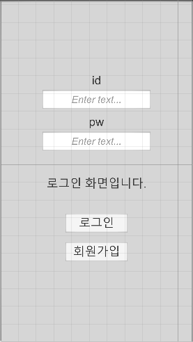

# 게임 서버 만들기 2

## **수업내용**

- 서버와 연결 시작하기 - 회원가입 기능 제작
    - 사전설정 하기
    - 기본 패널 만들기
    - 오브젝트와 스크립트 연동하기
    - 서버 관련 코드 설명
    - 서버와 연결하기

# 서버와 연결 시작하기 - 회원가입 기능

## 사전설정 하기

### 회원가입 시작 버튼만들기

 앞서 만든 로그인 패널에 새로운 패널인 회원가입 패널로 접근할 수 있게 새로운 버튼을 생성해줍니다.



```csharp
public void btnClick_start_signup()
    {
				pan_signup.SetActive(true);
        pan_login.SetActive(false);
    }
```


`SetActive`를 이용하여 회원가입 패널은 키고 로그인 패널은 사용을 중지한다.

### 초기 패널 설정

모든 패널의 초기 설정은 켜져있는 상태이므로, void Start()에서 가장 처음 켜져있어야 할 패널을 설정해 주어야 한다.

```csharp
void Start()
{
    pan_login.SetActive(true); // 처음 화면은 로그인 화면
    pan_signup.SetActive(false);
}
```

## 기본 패널 만들기

### pan_signup 만들기

 앞서 만든 로그인 기능을 사용하기 위해 새로운 아이디를 가입할 수 있는 패널을 생성할 수 있다.

앞서만든 패널인 pan_login 을 복사 붙여넣기를 이용하여 쉽게 옮길 수 있다.


대략적인 구성도


**if (inputfield)**

- **if_sign_id** : 회원가입할 아이디 입력칸
- **if_sign_pw** : 회원가입할 비밀번호 입력칸

**tx (text)**

- **tx_sign_id** : id 텍스트
- **tx_sign_pw** : pw 텍스트

**bt (button)**

- **bt_sign** : 회원가입 버튼

## 오브젝트와 스크립트 연동하기

### 유니티 에디터 설정하기

 로그인 패널과 마찬가지로 스크립트에서 사용할 오브젝트를 코드와 유니티 에디터를 이용하여 불러와 관리한다.

```csharp
[Header("pan_signup")]
public GameObject pan_signup;
public InputField if_sign_id;
public InputField if_sign_pw;
```


pan_login과 pan_signup에 오브젝트를 모두 할당한다.

## 서버 관련 코드 설명

### 서버의 php 코드

```php
<?php
date_default_timezone_set("Asia/Seoul");
$time = date("Y-m-d");
//unity import
$id = $_POST['Input_id'];
$pw = $_POST['Input_pw'];
$con = mysqli_connect("localhost","swhtest1","Ace14202!!");
mysqli_select_db($con,"swhtest1");
mysqli_query($con,"set names utf8");

$Result =  mysqli_query($con,"INSERT INTO  `user` ( `id` , `pw`,`score` , `time`) VALUES ('".$id."' , '".$pw."','0', '".$time."') ; ");

if ($Result)	
{	die("Singup-Success");

}
else
{	die("Singup-Failure");

}
?>
```

- 입력한 id, pw로 새로운 계정 정보를 생성
- 회원가입 성공시 "Singup-Success" 반환
- 회원가입 실패시 "Singup-Failure" 반환

### 유니티의 코드

```csharp
string url_signup = "swhtest.dothome.co.kr/signup.php";

...

IEnumerator co_signup()
{
    WWWForm form = new WWWForm();

    form.AddField("Input_id", if_sign_id.text);
    form.AddField("Input_pw", if_sign_pw.text);

    WWW webRequest = new WWW(url_signup, form);
    yield return webRequest;
    Debug.Log(webRequest.text);
    if (webRequest.text == "")   //인터넷에러
    {
        Debug.Log("internet Error");
        tx_login_result.text = "internet Error";
    }
    else
    {
        if (webRequest.text == "Singup-Success")
        {
            pan_signup.SetActive(false);
            pan_login.SetActive(true);
        }
        else
        {

        }
    }
}

```

- **`form.AddField`** : 유니티에서 서버로 보낼 값을 설정
- **`WWW webRequest**` : 연결할 서버 주소 설정
- **`yield return webRequest**` : 반환값을 webRequest에 저장
- **`Singup-Success`** : 회원가입 성공시 회원가입 패널을 종료하고 로그인 패널을 활성화함

## 서버와 연결하기

### 회원가입 버튼 만들기

 버튼을 눌렀을때 스크립트가 실행되기 위해서 스크립트에 코드를 추가해준 후 버튼을 설정해줍니다.

```csharp
public void btnClick_signup()
{
    StartCoroutine(co_signup());
}
```


### 결과확인

 직접 아이디 비밀번호를 생성해보고 미리 제작된 서버에서 생성 여부를 확인할 수 있다.


- 서버에서 확인해본 결과 정상적으로 추가됨


### 마지막으로 직접 로그인 되는지 확인하기

 앞서 생성한 아이디를 이용하여 다시 로그인을 하여 정상적으로 로그인되는지 확인한다.


