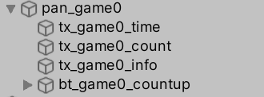

# 게임 서버 만들기 3

## **수업내용**

- UI 이용한 간단한 게임 만들기
    - 게임 목표 설정
    - 기본 패널 만들기
    - 오브젝트와 스크립트 연동하기
    - 사전설정 수정
- UI 활용하기
    - 점수 화면에 표현하기
    - 타이머 설정하기
    - 이펙트 추가하기

# UI 이용한 간단한 게임 만들기

 이번 예시에선 간단한 게임을 최대한 UI 를 활용해서 만들어 보도록 하겠습니다.

## 게임 목표 설정

 게임을 제작하기 전 간단한 게임의 목표를 설정하고 제작하겠습니다.

### 게임 설명

- 처음 버튼을 누르면 게임이 시작
- 게임이 시작되면 5초의 타이머가 감소하며 적어짐
- 타이머 시간이 다 되면 결과 화면으로 넘어감
- 제한시간동안 버튼을 클릭하는 횟수에 따라 점수 증가

## 기본 패널 만들기

### pan_game0 만들기

 게임에 필요한 패널과 다른 요소들을 생성합니다.



**tx (text)**

- **tx_game0_time** : 시간을 표시할 텍스트
- **tx_game0_count** : 몇 번 눌렀는지 표시할 텍스트
- **tx_game0_info** : 게임 안내 정보를 표시할 텍스트

**bt (button)**

- **bt_game0_countup** : 시작 및 게임 버튼

### 적절히 화면 배치하기


## 오브젝트와 스크립트 연동하기

### 유니티 에디터 설정하기

 스크립트에서 사용할 오브젝트를 코드와 유니티 에디터를 이용하여 불러와 관리한다.

```csharp
[Header("pan_game0")]
public GameObject pan_game0;
public Text tx_game0_time;
public Text tx_game0_count;
public GameObject bt_game0_countup;
//game0에서 사용할 변수
int g0_count;
```


## 사전 설정 수정

새로운 패널이 추가되었으므로 Start() 에서 pan_game0 관련 설정 추가

```csharp
void Start()
{
    pan_login.SetActive(true);
    pan_signup.SetActive(false);
    pan_game0.SetActive(false);
}
```

### 로그인 재설정하기

 로그인시 로그인 관련 정보를 저장해두고 활용할 수 있게 코드를 변경합니다.

**저장 관련 변수 생성**

```csharp
string m_id;
int m_bestscore;
int m_score;
```

**로그인 성공시 로그인 관련 정보 저장 및 게임으로 이동**

```csharp
IEnumerator co_login()
{
    WWWForm form = new WWWForm();

    form.AddField("Input_id", if_login_id.text);
    form.AddField("Input_pw", if_login_pw.text);

    WWW webRequest = new WWW(url_login, form);
    yield return webRequest;
    Debug.Log(webRequest.text);
    if (webRequest.text == "")   //인터넷에러
    {
        Debug.Log("internet Error");
        tx_login_result.text = "internet Error";
    }
    else
    {
        if (webRequest.text == "Login-Error-Id" || webRequest.text == "Login-Error-Pw")
        {
            tx_login_result.text = webRequest.text;
        }
        else
        {
            tx_login_result.text = webRequest.text;
            m_id = if_login_id.text;
            m_bestscore = int.Parse(webRequest.text);

            pan_game0.SetActive(true); // 게임 화면으로 이동
            pan_login.SetActive(false);
        }
    }
}
```

- **`m_id`, `m_bestscore`** : 로그인 정보 변수에 저장
- **`pan_game0.SetActive`** : 로그인 화면 끄고 게임 화면으로 이동

# UI 활용하기

## 점수 화면에 표현하기

### 버튼 설정하기

 버튼을 눌렀을 때 카운트가 올라가고 화면에 표시될 수 있도록 설정해줍니다.

```csharp
public void btnClick_count()
    {
				// 카운트 올리고 화면에 표시하기
        g0_count += 1;
        tx_game0_count.text = ""+g0_count;
    }
```


## 타이머 설정하기

 타이머를 이용하여 남은 시간을 표시해줍니다.

타이머의 시작은 버튼을 눌렀을 경우이므로 버튼 설정을 바꾸어줍니다.

### **필요 변수 추가해주기**

```csharp
[Header("pan_game0")]
public GameObject pan_game0;
public Text tx_game0_time;
public Text tx_game0_count;
public GameObject bt_game0_countup;
//game0에서 사용할 변수
int g0_count;
int g0_LeftTime = 5; float g0_NextTime = -1; //타이머 관련 변수
```

- **`g0_LeftTime`** : 타이머 종료까지 남은 시간 (sec)
- **`g0_NextTime`** : 다음 타이머 작동 예정 시간

### **update 함수 작성**

 다양한 방법의 타이머 구현 방법이 있지만 예시에선 update를 이용하여 타이머 함수를 구현하였습니다.

```csharp
void Update()
{
    if (g0_NextTime >= 0)
    {
        if (g0_LeftTime <= 0)   //시간초과경우
        {
            //패널 이동
            //pan_result.SetActive(true);
            pan_game0.SetActive(false);

            //점수 업데이트
            m_score = g0_count;
						Debug.Log("m_score : " + m_score + "\nm_bestscore : " + m_bestscore);

            //값 초기화
            g0_LeftTime = 5;
            g0_NextTime = -1;
						g0_count = 0;
            tx_game0_time.text = "" + g0_LeftTime;
            tx_game0_count.text = ""+g0_count;
            return;
        }
        //1초 지났을 경우
        if (Time.time > g0_NextTime) 
        {
            g0_NextTime = Time.time + 1;   

            g0_LeftTime -= 1;
            tx_game0_time.text = ""+g0_LeftTime;
        }
    }
}
```

- **`g0_NextTime ≥ 0` :** g0_NextTime 초기값이 -1 임을 이용하여 0보다 값이 같거나 클경우 타이머가 시작되었다고 판단합니다.
- **`g0_LeftTime ≤ 0`  :** g0_LeftTime 이 0보다 같거나 작은경우 타이머가 종료되었다 판단합니다.
- **`Time.time > g0_NextTime`** : 다음 타이머 작동 시간이 되면 다시 g0_NextTime을 갱신해주고 남은 시간을 1 줄여줍니다.

### 버튼 설정하기

 타이머 관련 코드를 추가해줍니다.

g0_NextTime 의 초기값이 -1 임을 이용하여 타이머 시작 여부를 확인할 수 있습니다. 

```csharp
public void btnClick_count()
    {
				// 카운트 올리고 화면에 표시하기
        g0_count += 1;
        tx_game0_count.text = ""+g0_count;

        // 타이머 시작하기
        if (g0_NextTime == -1)
        {
            g0_NextTime = Time.time + 1;
        }

    }
```

### 결과 확인

 게임을 직접 테스트해보고 결과를 확인할 수 있습니다.

Debug를 통해 서버에 저장된 최대 기록과 현재 기록을 확인 가능합니다.


## 이펙트 추가하기

- 버튼을 누르면 점점 텍스트와 버튼을 커지도록 설정합니다.
- 버튼 이미지는 계속 회전하도록 합니다.

### 사전설정

 이펙트 추가를 위해 사용해야 할 변수를 추가해줍니다.

```csharp
[Header("pan_game0")]
public GameObject pan_game0;
public Text tx_game0_time;
public Text tx_game0_count;
public GameObject bt_game0_countup;
//game0에서 사용할 변수
int g0_count;
int g0_LeftTime = 5; float g0_NextTime = -1; //시간 관련 변수
float spin = 0; float spin_speed = 0.3f; //이펙트 관련 변수
```

- `spin` : 현재 버튼 이미지의 회전 각도
- `spin_speed` : 한 프레임당 변화할 회전 각도

### 회전 기능 및 텍스트, 버튼 크기 변경하기

 Update에서 버튼이 계속해서 회전할 수 있도록 설정합니다.

```csharp
void Update()
{
    bt_game0_countup.transform.eulerAngles = new Vector3(0, 0, spin);
    spin -= spin_speed;

    if (g0_NextTime >= 0)
    {
        ...
```

- `bt_game0_countup.transform.eulerAngles` : 현재 버튼의 회전 각도를 spin으로 설정합니다.
- `spin -= spin_speed` : 매 프레임당 spin_speed 만큼 회전 각도를 감소시킵니다.

```csharp
public void btnClick_count()
{
    // 카운트 올리고 화면에 표시하기
    g0_count += 1;
    tx_game0_count.text = ""+g0_count;
    bt_game0_countup.transform.localScale += new Vector3(g0_count * 0.01f, g0_count * 0.01f, 0);
    tx_game0_count.rectTransform.localScale += new Vector3(g0_count * 0.01f, g0_count * 0.01f, 0);

    // 타이머 시작하기
    if (g0_NextTime == -1)
    {
        g0_NextTime = Time.time + 1;
    }
}
```

- `bt_game0_countup.transform.localScale` : 버튼을 클릭할때마다 g0_count / 100 만큼 버튼 크기를 증가시킨다.
- `tx_game0_count.rectTransform.localScale` : 버튼을 클릭할때마다 g0_count / 100 만큼 텍스트 크기를 증가시킨다.

### 결과

 버튼을 여러번 눌렀을 경우 버튼 크기와 텍스트 크기가 같이 증가하는 것을 확인할 수 있다.


