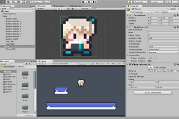
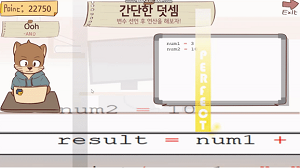
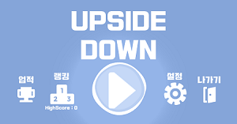
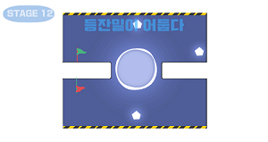

# HAE-U
해달 + 유니티

경북대학교 IT대학 동아리 **해달**의 게임 개발 트랙  
유니티(게임개발 프로그램)을 활용

# 트랙 정보
 
 * 처음 유니티를 접해보는 트랙원들을 위해 2~3주의 기초 유니티 사용법 강좌가 있습니다.
 
  플랫폼 게임을 직접 만들어보며 유니티 기초를 배우자!
 
 * 게임 개발의 기초를 배우신 트랙원들은 3~4명씩 팀을 이루어 각자만의 게임장르, 게임개발 목표를 정합니다.
 * 이렇게 제작한 게임으로 **경북대학교 코드페어**나 기타 공모전에 참가하는 것이 최종 목표입니다.

# 활동내용[팀 리듬코딩]
 * 프로젝트 설명 : 리듬게임과 코딩을 합쳐 재밌게 코딩을 공부할 수 있는 게임. (PC)  
 **경북대학교 코드페어(19.11.20) 최우수상 수상** 
 * 팀원 : 윤치호(메인코딩), 장우진(서브코딩,디자인), 박지환(기획)
 * 게임 실행 영상(https://www.youtube.com/watch?v=sYgiWUvvGiQ)
 * 관련사진
 
 
 
 
# 활동내용[업사이드다운]

 * 프로젝트 설명 : 중력을 바꾸어가며 stage 클리어하는 플랫폼 게임 (Android)
 * 팀원 : 윤치호, 장우진(캐릭터 디자인)
 * 게임 실행 영상(https://www.youtube.com/watch?v=NZiZURiTpno)
 * 게임 다운로드 링크(https://play.google.com/store/apps/details?id=com.CHHO.UPSIDEDOWN)
 * 관련사진.
 
 
 
